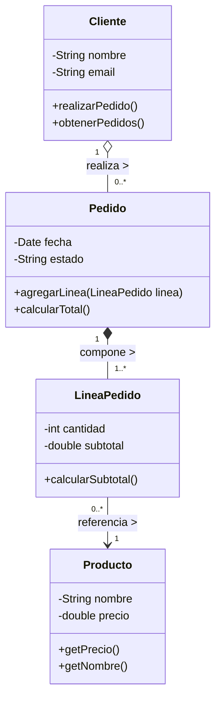

```mermaid
classDiagram
    class Cliente {
        -String nombre
        -String email
        +realizarPedido()
        +obtenerPedidos()
    }

    class Pedido {
        -Date fecha
        -String estado
        +agregarLinea(LineaPedido linea)
        +calcularTotal()
    }

    class LineaPedido {
        -int cantidad
        -double subtotal
        +calcularSubtotal()
    }

    class Producto {
        -String nombre
        -double precio
        +getPrecio()
        +getNombre()
    }

    %% Relaciones
    Cliente "1" o-- "0..*" Pedido : realiza >
    Pedido "1" *-- "1..*" LineaPedido : compone >
    LineaPedido "0..*" --> "1" Producto : referencia >
```
