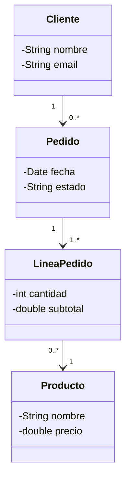

```mermaid
classDiagram
    class Cliente {
        -String nombre
        -String email
    }

    class Pedido {
        -Date fecha
        -String estado
    }

    class LineaPedido {
        -int cantidad
        -double subtotal
    }

    class Producto {
        -String nombre
        -double precio
    }

    %% Relaciones sin indicar tipo de agregación
    Cliente "1" --> "0..*" Pedido
    Pedido "1" --> "1..*" LineaPedido
    LineaPedido "0..*" --> "1" Producto
```
