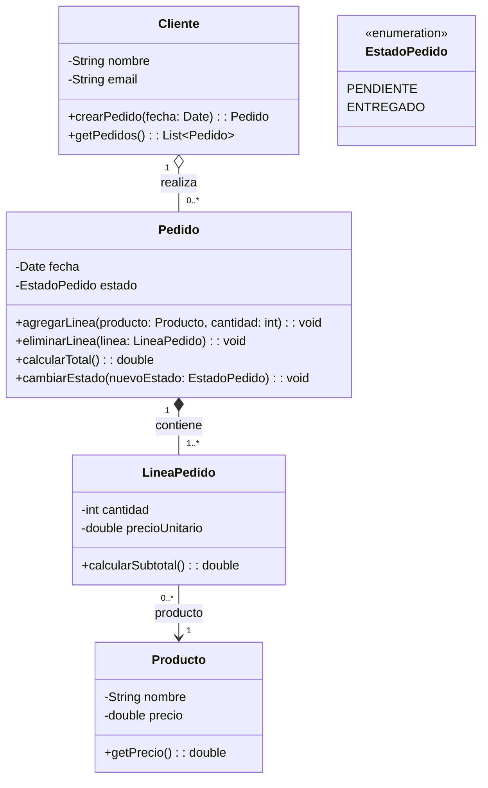

## Diagrama de clases Pedidos y relaciones

```mermaid
classDiagram

class Cliente {
  -String nombre
  -String email
  +crearPedido(fecha: Date): Pedido
  +getPedidos(): List~Pedido~
}

class Pedido {
  -Date fecha
  -EstadoPedido estado
  +agregarLinea(producto: Producto, cantidad: int): void
  +eliminarLinea(linea: LineaPedido): void
  +calcularTotal(): double
  +cambiarEstado(nuevoEstado: EstadoPedido): void
}

class LineaPedido {
  -int cantidad
  -double precioUnitario
  +calcularSubtotal(): double
}

class Producto {
  -String nombre
  -double precio
  +getPrecio(): double
}

class EstadoPedido {
  <<enumeration>>
  PENDIENTE
  ENTREGADO
}

Cliente "1" o-- "0..*" Pedido : realiza
Pedido "1" *-- "1..*" LineaPedido : contiene
LineaPedido "0..*" --> "1" Producto : producto
```
